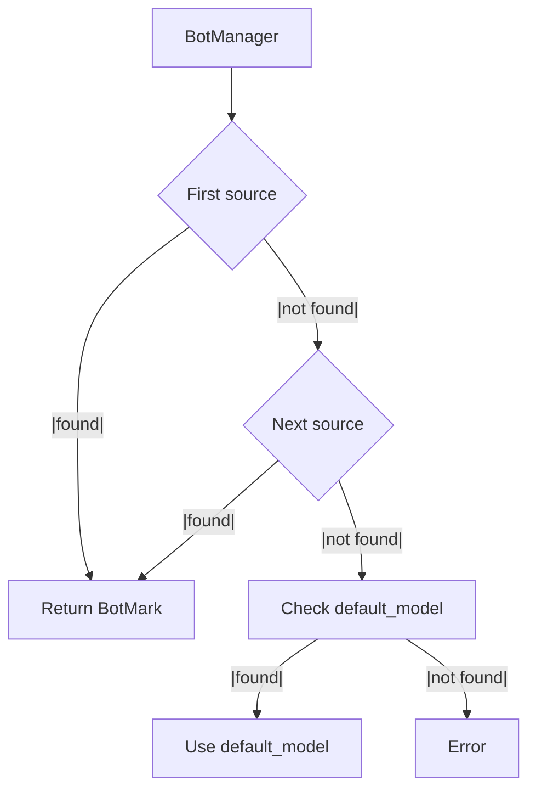

# BotMark – Structured Chatbots in Markdown

**BotMark** lets you define, run, and document chatbots entirely in Markdown — combining the **system prompt**, **data schema**, **output templates**, and optional **multi-agent workflows** in one file.

This **single source of truth** makes bots easier to maintain, version-control, and test — all without locking you into a specific LLM or backend.

---

## ✨ Why BotMark?

- **One file = one bot** → prompts, schema, and docs stay in sync
- **LLM-agnostic** → works with OpenAI, Claude, local models, or any API
- **Version-friendly** → plain Markdown plays well with Git
- **Executable** → run directly via Python’s `botmark` package
- **Extensible** → add custom tools, topics, and agent graphs

| Feature                        | Description                                                                 |
|-------------------------------|-----------------------------------------------------------------------------|
| ✅ Markdown-based              | Bot definitions live in a structured Markdown format.                       |
| ✅ LLM-agnostic                | Works with any LLM (e.g. OpenAI, Claude, local models).                     |
| ✅ Executable in Python        | Easily run bots using the `botmark` Python package.                         |
| ✅ Single source of truth      | One file defines bot behavior, schema, and user docs.                       |
| ✅ Multi-bot support           | Load multiple bots via folder-based setup.                                  |
| ✅ Easy export                 | Generate Word, HTML, or PDF docs using Pandoc.                              |

---

## 📦 Installation

BotMark is designed to **integrate cleanly into real development environments**: a lean base install, opt-in provider extras, and predictable, lockfile-friendly dependency resolution.

> Requires **Python 3.11+**

### Base install (lean core)

Installs BotMark with the slim runtime:

```bash
pip install botmark
```

This keeps your environment minimal and fast to resolve. Add model/provider integrations only when you need them.

### Provider extras (pass-through to `pydantic-ai-slim`)

Choose exactly the backends/tools you use — we forward extras 1:1 to `pydantic-ai-slim`:

* **Model/Provider**: `openai`, `anthropic`, `groq`, `mistral`, `cohere`, `bedrock`, `vertexai`, `google`, `huggingface`
* **Search/Tools**: `duckduckgo`, `tavily`, `cli`, `mcp`, `a2a`, `ag-ui`
* **Observability/Evals**: `logfire`, `evals`

Examples:

```bash
# OpenAI only
pip install "botmark[openai]"

# OpenAI + CLI helpers + Groq
pip install "botmark[openai,cli,groq]"

# Observability (logfire) and evals
pip install "botmark[logfire,evals]"
```

### Everything slim

Grab BotMark plus **all** slim extras (useful for experimentation; heavier footprint):

```bash
pip install "botmark[all]"
```

### Full `pydantic-ai` (non-slim)

If you prefer the full distribution bundled by `pydantic-ai`:

```bash
pip install "botmark[pydantic_ai]"
```

This installs `pydantic-ai[all]` under the hood.

---

## 🧑‍💻 Works with your toolchain

Use the same extras with Poetry, uv, pip-tools, etc.

**Poetry**

```bash
# base
poetry add botmark
# with extras
poetry add botmark -E openai -E cli
```

**uv**

```bash
uv add botmark
uv add 'botmark[openai,groq]'
```

**pip-tools**

```bash
# requirements.in
echo 'botmark[openai,cli]' >> requirements.in
pip-compile && pip-sync
```

**Editable/local dev**

```bash
# from a cloned repo
pip install -e .
# with extras during dev
pip install -e ".[openai,cli]"
```

---

## ✅ Why this layout integrates well

* **Minimal by default**: base install is slim and quick; no surprise transitive bloat.
* **Explicit capabilities**: opt into only the providers/tools you actually use.
* **Lockfile-friendly**: deterministic, easy to pin in Poetry/pip-tools/uv.
* **Composable**: combine extras freely (`[openai,groq,cli,logfire]`).
* **Escape hatch**: need everything? Use `botmark[all]` or `botmark[pydantic_ai]`.

---

## 📘 What is BotMark?

A BotMark file is just **Markdown** with special **code block attributes** to define:

* **System prompt** – instructions for the LLM (`{#system}`)
* **Response template** – output rendering (`{#response}`)
* **Schema** – input validation (`{#schema}`)
* **Optional tools** – Python functions callable by the bot (`.tool`)
* **Optional graphs** – multi-agent workflows (`{#graph}`)
* **Optional topics** – pattern-based routing

All of this is contained in a **single `.md` file**, making it versionable, testable, and human-readable.

Example minimal bot:

```markdown
---
title: Hello World Bot
---

~~~markdown {#response}
Hello World 🌍
~~~
```

## 🧩 Quick Syntax Reference

* **YAML frontmatter** → metadata (`title`, `model`, `abstract`, etc.)
* **Code blocks** with `{#...}` → bot logic
* **`.tool` blocks** → Python functions available to the bot
* **`{#graph}`** → Mermaid diagrams defining agent flows
* **Topics table** → optional regex/pattern routing

---

### Example 1 – A Simple Email writer

```markdown
---
title: Simple Email Writer
model: gpt-5
---

~~~markdown {#system}
You are an assistant that writes short, friendly emails.
After receiving feedback, update your draft and output the improved email.
~~~
```

---

### Example 2 – System, Response, Schema

```markdown
---
title: Hello World Bot
model: gpt-5
---

~~~markdown {#system}
You are a Hello World bot.
Your sole purpose is to greet the user warmly using the provided `message` and `name` from the schema.
~~~

~~~jinja2 {#response}
Message to {{ RESPONSE["name"] }} : {{ RESPONSE["message"] }} {{ RESPONSE["name"] }} 🌍
~~~

~~~json {#schema}
{
  "type": "object",
  "properties": {
    "message": { "type": "string", "description": "Text to start the response with." },
    "name": { "type": "string", "description": "Name of the person. Use Jane Doe if unknown" }
  },
  "required": ["message", "name"]
}
~~~

```

---

### Example 3 – Topics (simple routing)

```markdown
---
title: Hello World Bot with Topics
model: gpt-5
---

| topic    | description                       | prompt_prefix | prompt_suffix | prompt_regex |
| -------- | --------------------------------- | ------------- | ------------- | ------------ |
| question | Detect if message ends with a "?" |               |       ?       |              |

~~~markdown {#system}
You are a Hello World bot.
~~~

~~~jinja2 {#response match="question"}
Good question: {{ RESPONSE["message"] }}
~~~

~~~jinja2 {#response}
{{ RESPONSE["message"] }}
~~~

~~~json {#schema}
{
  "type": "object",
  "properties": {
    "message": { "type": "string", "description": "User's message or question." }
  },
  "required": ["message"]
}
~~~
```

**Topics & Matching**

* You can define **multiple topics**.
* The `match` attribute supports **logical expressions**: `and`, `or`, `not`.

  * Examples:

    * `match="greeting and not goodbye"`
    * `match="question or email_format"`
    * `match="not number_check"`
* If multiple topics match, the **most specific/complex** match wins.

**Security & Code Execution**

* `allow_code_execution` is **`False` by default**.
* When **disabled** (default):

  * Define your schema in a **`json`** code block using a standard **JSON Schema**.
  * Write your templates in **Jinja2**, which is safe for rendering and does not execute arbitrary Python code.
* When **enabled** (`allow_code_execution=True`):

  * You may define the schema in a **Python** code block (e.g., a **Pydantic BaseModel**).
  * Templates can use **Mako**, which supports embedded Python code and advanced logic.
* ⚠️ Because Mako and Python blocks can execute arbitrary code, enable this **only in trusted environments**.

### Example 4 – Tools

```markdown
---
title: Hello World Tool Bot
subtitle: Minimal Conversational AI demonstrating a date/time tool
abstract: A simple bot that can greet the user and return the current date and time.
model: gpt-5
---

# System Prompt

~~~markdown {#system}
You are a Hello World bot.  
You can greet the user and provide the current date and time.
~~~

# Tool: Get Current Date and Time

~~~python {#get_datetime .tool}
def get_current_datetime() -> str:
    '''Return the current date and time as a string.'''

    from datetime import datetime
    return datetime.now().strftime("%Y-%m-%d %H:%M:%S")
~~~

```

This example demonstrates how to use a simple Python tool inside a BotMark bot to return the current date and time.
The `get_current_datetime` function uses Python’s `datetime` module to generate a timestamp in the format `YYYY-MM-DD HH:MM:SS`.

**Key points:**

* The tool is defined in a Python code block with the `.tool` attribute.
* **`allow_code_execution` must be set to `True`** when creating the `BotManager` in Python, otherwise the tool will not run.
* Code execution is disabled by default for security reasons, as it allows arbitrary Python code to be executed from the bot definition.
* Only enable this in a trusted environment where you control the bot files.

When the bot receives a message like *"What’s the date and time?"*, it will call the `get_current_datetime` tool and return the current timestamp.

### Example 5 – Graphs (advanced)

BotMark supports defining **multi-agent workflows** using **Mermaid state diagrams** in a `#graph` code block.
The *main agent* runs first, then passes its output through the agents defined in the graph.
Each agent can modify, review, or add to the result before returning control to the main agent for a final output.

In this Hello World example:

* The **main agent** writes a short email.
* The **review agent** forces **emojis at the start and end** of the email.
* (In practice, the review agent can enforce **any user-dependent logic**: tone, length, formatting, etc.)
* The main agent incorporates feedback and outputs the improved email.

````markdown
---
title: Simple Email Review Graph
model: gpt-5
---

# Main Agent

~~~markdown {#system}
You are an assistant that writes short, friendly emails.
After receiving feedback, update your draft and output the improved email.
~~~

# Graph

# [*] refers to the main agent.
# Initially the main agent writes the email.
# The review agent gives feedback.
# The main agent improves the email and outputs the final version.

~~~mermaid {#graph}
stateDiagram-v2
    [*] --> review_agent
    review_agent --> [*]
~~~

# Review Agent

~~~markdown {#review_agent .agent}
---
title: review_agent
---


```markdown {#response}
Add at least one emoji at the **start** and one at the **end** of the email text
```
~~~
````

**How it works**

1. User sends a request → main agent writes an initial email.
2. Graph routes the draft to the `review_agent`.
3. `review_agent` returns concise feedback (e.g., “Add an emoji at the start and one at the end”).
4. Main agent updates the email based on the feedback.
5. Final improved email is returned to the user.

---

### Suggestion Prompt (ready to paste)

```markdown
Write a e-mail to a friend
```

## 🐍 Using `BotManager` in Python

`BotManager` has two main purposes:

1. **Create a standalone Agent from a BotMark definition**
   Use `get_agent(...)` to obtain a **Pydantic-based AI agent** that is configured by a BotMark file/string.
   You can then use this agent independently of any model lookup or source.

   **Signature**

   ```python
   def get_agent(self, bot_definition: Union[str, dict]):
       ...
   ```

   **Example**

   ````python
   from botmark import BotManager

   botmark_md = "```markdown {#response}\nHello World!\n```"
   mgr = BotManager()
   agent = mgr.get_agent(botmark_md)   # returns a configured, standalone agent
   # agent.run(...), agent.handle(...), etc. (depending on your Agent API)
   ````

2. **Manage multiple bots via sources and `default_model`**
   `BotManager` can resolve models from one or more **Botmark sources** (e.g., built-in `FileSystemSource`, custom sources like a Langfuse-backed loader).
   If no source resolves a model, it can use a **`default_model`**; otherwise, an error is raised.

   * `get_models()` returns a JSON object **analogous to OpenAI’s `/models`** endpoint, containing models aggregated from all configured sources.
   * `respond()` creates an answer from an **OpenAI-compatible request payload** (messages, model, etc.).

     * `respond()` is **async**
     * `respond_sync()` is the **synchronous** counterpart

   **Example**

   ```python
   from botmark import BotManager, FileSystemSource

   src = FileSystemSource(bot_dir="bots/")
   mgr = BotManager(botmark_source=src)

   # List models (OpenAI-like shape)
   models = mgr.get_models()
   # => {"object": "list", "data": [{"id": "...", "object": "model", "created": 123, "owned_by": "FileSystemSource"}, ...]}

   # Sync respond
   msg = {
     "model": "hello_world",  # resolved via sources
     "messages": [
       {"role": "user", "content": "Hi there"}
     ]
   }
   result = mgr.respond_sync(msg)
   print(result)

   # Async respond
   # import asyncio
   # result = asyncio.run(mgr.respond(msg))
   ```

**Resolution order (summary)**

1. If `model` is provided: try sources in order → if none found, use `default_model` → otherwise error.
2. If `model` is missing: use `default_model` → otherwise error.

---

### 1) From a **folder of bots** (built-in FileSystemSource)

```python
from botmark import BotManager, FileSystemSource

src = FileSystemSource(bot_dir="bots/")
bot = BotManager(botmark_source=src)

msg = {
  "model": "foo",
  "messages": [{ "role": "user", "content": "Hi there" }]
}
print(bot.respond(msg))
```

---

### 2) Using a **default model** (string or `StringIO`)

````python
from botmark import BotManager
import io

botmark_md = "```markdown {#response}\nHello World!\n```"
bot = BotManager(default_model=botmark_md)

msg = {"messages": [{ "role": "user", "content": "Hello" }]}
print(bot.respond(msg))
````

---

### 3) Using a **custom source** — Langfuse example

> This example shows how to implement your own `BotmarkSource` to pull definitions from Langfuse.
> Requires `pip install langfuse` and Langfuse credentials in ENV:
> `LANGFUSE_PUBLIC_KEY`, `LANGFUSE_SECRET_KEY`, `LANGFUSE_HOST`.

```python
import time
from typing import Dict, Any, List, Optional
from langfuse import Langfuse, get_client
from botmark import BotmarkSource

langfuse = Langfuse(
    secret_key="sk-...",
    public_key="pk-...",
    host="https://..."
)

class LangfuseSource(BotmarkSource):
    def __init__(
        self,
        version_label: str = "production",   # "production" or "latest"
        id_prefix: str = "",              # keep consistent
        id_suffix: str = "",
        allow_fallback_to_latest: bool = False
    ):
        super().__init__()
        self.client = get_client()
        self.version_label = version_label.strip().lower()
        self.id_prefix = id_prefix
        self.id_suffix = id_suffix
        self.allow_fallback_to_latest = allow_fallback_to_latest

    # ---------- helpers ----------
    def _encode_id(self, name: str) -> str:
        return f"{self.id_prefix}{name}{self.id_suffix}"

    def _decode_id(self, model_id: str) -> str:
        """Strip prefix/suffix safely; return the raw Langfuse prompt name."""
        raw = model_id
        if self.id_prefix and raw.startswith(self.id_prefix):
            raw = raw[len(self.id_prefix):]
        if self.id_suffix and raw.endswith(self.id_suffix):
            raw = raw[: -len(self.id_suffix)]
        return raw

    def _has_label(self, name: str, label: str) -> bool:
        try:
            _ = self.client.get_prompt(name, label=label)
            return True
        except Exception:
            return False

    # ---------- public API ----------
    def list_models(self) -> Dict[str, Any]:
        models: List[Dict[str, Any]] = []
        try:
            prompts = self.client.api.prompts.list().data
            seen = set()
            now = int(time.time())
            for p in prompts:
                name = getattr(p, "name", None) or getattr(p, "id", None)
                if not name or name in seen:
                    continue
                seen.add(name)
                # Only include prompts that actually have the requested label
                if self._has_label(name, self.version_label):
                    models.append({"id": self._encode_id(name), "created": now})
        except Exception as e:
            print(f"⚠️ Could not list Langfuse prompts: {e}")

        defaults = {"object": "model", "owned_by": "LangfuseSource"}
        return {"object": "list", "data": [defaults | m for m in models]}

    def load_botmark(self, model_id: str):
        """Load the configured label; optional fallback to latest."""
        raw_name = self._decode_id(model_id)
        try:
            prompt = self.client.get_prompt(raw_name, label=self.version_label)
            return getattr(prompt, "prompt", None)
        except Exception as e_primary:
            if self.allow_fallback_to_latest and self.version_label != "latest":
                try:
                    prompt = self.client.get_prompt(raw_name, label="latest")
                    print(f"ℹ️ Fallback: loaded 'latest' for '{raw_name}'.")
                    return getattr(prompt, "prompt", None)
                except Exception as e_fallback:
                    print(f"⚠️ Fallback to latest failed for '{raw_name}': {e_fallback}")
            print(f"⚠️ Error loading {self.version_label} prompt '{raw_name}': {e_primary}")
            return None

# Example usage
src = LangfuseSource()
bot = BotManager(source=src)

msg = {
  "model": "hello_world_bot",  # Langfuse prompt name
  "messages": [{ "role": "user", "content": "Hello" }]
}
print(bot.respond(msg))
```

---

### 4) Combining multiple sources

```python
from botmark import BotManager, FileSystemSource

sources = [
    FileSystemSource(bot_dir="bots/"),
    LangfuseSource(),  # custom source from above
]

bot = BotManager(source=sources)

msg = {
  "model": "foo",  # checks FileSystemSource first, then LangfuseSource
  "messages": [{ "role": "user", "content": "Hello" }]
}
print(bot.respond(msg))
```

#### How multiple sources work



> **Order matters**: The first source that returns a BotMark string wins.

---

## ⚠️ Security Note

The parameter `allow_code_execution` is **`False` by default**.
When enabled:

* The bot schema can be defined via a Python code block (using a **Pydantic BaseModel**).
* The bot’s response template can be rendered using the **Mako template engine**, which supports embedded Python code.

Because Mako allows executing arbitrary Python, **this feature is disabled by default for security reasons**. Only enable it in trusted environments where you control the bot definitions.

---

## 🌐 LLM Agnostic

BotMark does not rely on a specific LLM.
It structures instructions and output templates that **any LLM** can follow — including OpenAI, Claude, Mistral, or your own local model.

* Swap LLMs without changing the bot definition.
* Run evaluation or A/B tests using the same `.md` file.

## 📤 Exporting Documentation

Since everything is written in Markdown, you can export bot definitions and user docs via [Pandoc](https://pandoc.org):

### Export user documentation (with Lua filter)

```bash
pandoc botname.md --lua-filter=extract_userdoc.lua --toc -o userdoc.docx
```

### Export full bot definition

```bash
pandoc botname.md --toc -o complete_bot.docx
```

> This approach enforces **consistency** and reduces duplication across code and documentation.

## Examples

[System Fault Reporter](examples/documentation/system_fault_reporter.md?raw=1)

## ✅ Summary

BotMark is ideal for teams who want:

* Transparent and maintainable chatbot definitions
* LLM vendor flexibility
* Better developer–writer collaboration
* Clean exportable documentation
* One file to define everything — the system, the data, and the output

> 🧩 **Define once. Run anywhere. Document effortlessly.**

## 🔓 License

MIT – use freely, modify openly, contribute happily.
