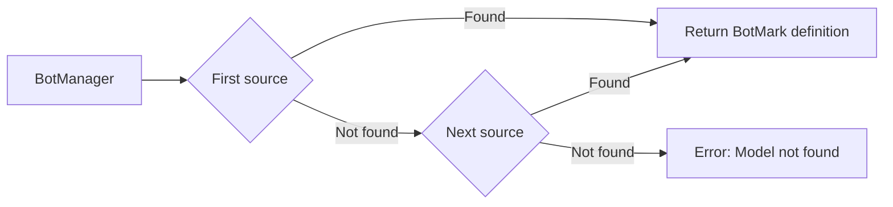

# BotMark – Structured Chatbots in Markdown

**BotMark** is a framework for defining, running, and documenting chatbots using plain Markdown — independent of any specific LLM or backend.

It enables a **single-source-of-truth** approach: chatbot logic, user guidance, data schema, and response formatting are all written in one Markdown file, which can be directly executed, tested, or exported.

---

## ✨ At a Glance

| Feature                        | Description                                                                 |
|-------------------------------|-----------------------------------------------------------------------------|
| ✅ Markdown-based              | Bot definitions live in a structured Markdown format.                       |
| ✅ LLM-agnostic                | Works with any LLM (e.g. OpenAI, Claude, local models).                     |
| ✅ Executable in Python        | Easily run bots using the `botmark` Python package.                         |
| ✅ Single source of truth      | One file defines bot behavior, schema, and user docs.                       |
| ✅ Multi-bot support           | Load multiple bots via folder-based setup.                                  |
| ✅ Easy export                 | Generate Word, HTML, or PDF docs using Pandoc.                              |

---

## 📦 Installation

You can install **BotMark** via pip:

```bash
pip install botmark
```

> Requires **Python 3.11+**

## 📘 What is BotMark?

BotMark is a format and Python runtime for defining chatbots declaratively.  
Instead of writing behavior in code, you define:

- The **system prompt** (what the LLM should do)
- The **data schema** (what inputs the bot expects)
- The **response template** (how to render output for the user)

All of this is contained in a **single `.md` file**, making it versionable, testable, and human-readable.


## 🧩 BotMark Syntax (Quick Guide)

**Format & Header**
- BotMark files begin with a **YAML frontmatter header** at the top.
- **Any keys are allowed**; `title`, `subtitle`, and `abstract` are recommended if you plan to export documentation via **Pandoc**.
- There are **reserved keys**. The most important is:
  - `model` → defines the language model (e.g., `model: gpt-5`).
- Between code blocks, you can add **any Markdown** for documentation purposes.  
  This content has **no effect** on bot execution — it’s purely informative.

**Building Blocks**
- **Code blocks** with attribute syntax control the chatbot’s behavior:
  - `markdown` (e.g., `{#system}`, `{#response}`)
  - `json` (e.g., `{#schema}`)
  - `jinja2` (templates/rendering)
  - `mermaid` (diagrams, advanced)
  - *(if code execution is enabled)* `python`, `mako`
- **Links and images** are allowed.
- Optionally, a **topics table** can be defined for pattern-based routing.
- Code blocks are marked with **attributes** (e.g., `{#response}`, `match="..."`) and are processed accordingly.

---

### Example 1 – Minimal, no model
```markdown
---
title: Hello World Bot
abstract: >
  A minimal test suite for a conversational AI bot that always responds with "Hello World!" regardless of the input.
---

~~~markdown {#response}
Hello World 🌍
~~~
```

---

### Example 2 – System, Response, Schema (with model)
```markdown
---
title: Hello World Bot
model: gpt-5
---

~~~markdown {#system}
You are a Hello World bot.
Your sole purpose is to greet the user warmly using the provided `message` and `name` from the schema.
~~~

~~~jinja2 {#response}
Message to {{ RESPONSE["name"] }} : {{ RESPONSE["message"] }} {{ RESPONSE["name"] }} 🌍
~~~

~~~json {#schema}
{
  "type": "object",
  "properties": {
    "message": { "type": "string", "description": "Text to start the response with." },
    "name": { "type": "string", "description": "Name of the person. Use Jane Doe if unknown" }
  },
  "required": ["message", "name"]
}
~~~

```

---

### Example 3 – Topics (simple routing)

```markdown
---
title: Hello World Bot with Topics
model: gpt-5
---

| topic    | description                       | prompt_prefix | prompt_suffix | prompt_regex |
| -------- | --------------------------------- | ------------- | ------------- | ------------ |
| question | Detect if message ends with a "?" |               |       ?       |              |

~~~markdown {#system}
You are a Hello World bot.
~~~

~~~jinja2 {#response match="question"}
Good question: {{ RESPONSE["message"] }}
~~~

~~~jinja2 {#response}
{{ RESPONSE["message"] }}
~~~

~~~json {#schema}
{
  "type": "object",
  "properties": {
    "message": { "type": "string", "description": "User's message or question." }
  },
  "required": ["message"]
}
~~~
```

**Topics & Matching**
- You can define **multiple topics**.
- The `match` attribute supports **logical expressions**: `and`, `or`, `not`.
  - Examples:
    - `match="greeting and not goodbye"`
    - `match="question or email_format"`
    - `match="not number_check"`
- If multiple topics match, the **most specific/complex** match usually wins.

**Security & Code Execution**
- `allow_code_execution` is **`False` by default**.  
  When enabled:
  - The schema can be defined in a **Python** code block (Pydantic BaseModel).
  - Templates can be rendered using **Mako**, which supports embedded Python.
- Because Mako can execute arbitrary Python, enable this **only in trusted environments**.


### Example 4 – Tools

````markdown
---
title: Hello World Tool Bot
subtitle: Minimal Conversational AI demonstrating a date/time tool
abstract: A simple bot that can greet the user and return the current date and time.
model: gpt-5
---

# System Prompt

~~~markdown {#system}
You are a Hello World bot.  
You can greet the user and provide the current date and time.
~~~

# Tool: Get Current Date and Time

~~~python {#get_datetime .tool}
from datetime import datetime

def get_current_datetime() -> str:
    '''Return the current date and time as a string.'''
    return datetime.now().strftime("%Y-%m-%d %H:%M:%S")
~~~

````

This example demonstrates how to use a simple Python tool inside a BotMark bot to return the current date and time.  
The `get_current_datetime` function uses Python’s `datetime` module to generate a timestamp in the format `YYYY-MM-DD HH:MM:SS`.

**Key points:**
- The tool is defined in a Python code block with the `.tool` attribute.
- **`allow_code_execution` must be set to `True`** when creating the `BotManager` in Python, otherwise the tool will not run.
- Code execution is disabled by default for security reasons, as it allows arbitrary Python code to be executed from the bot definition.
- Only enable this in a trusted environment where you control the bot files.

When the bot receives a message like *"What’s the date and time?"*, it will call the `get_current_datetime` tool and return the current timestamp.


### Example 5 – Graphs (advanced)


## 🧪 Example BotMark File

```markdown
---
title: Hello World Bot
abstract: >
  A minimal test suite for a conversational AI bot that always responds with "Hello World!" regardless of the input. 
---

~~~markdown {#response}
Hello World 🌍
~~~

```

## 🐍 Using `BotManager` in Python

BotMark now loads definitions via **sources** — any class that implements:
- `list_models() -> {"object": "list", "data": [...]}`  
- `load_botmark(model_id: str) -> str | None` (raw BotMark markdown)

The built-in source is:
- `FileSystemSource(bot_dir="...")` — loads `.md` BotMark files from disk.

You can also define **custom sources** (e.g., Langfuse, databases, APIs).

---

### 1) From a **folder of bots** (built-in FileSystemSource)

```python
from botmark import BotManager, FileSystemSource

src = FileSystemSource(bot_dir="bots/")
bot = BotManager(source=src)

msg = {
  "model": "foo",
  "messages": [{ "role": "user", "content": "Hi there" }]
}
print(bot.respond(msg))
```

---

### 2) Using a **default model** (string or `StringIO`)

```python
from botmark import BotManager
import io

botmark_md = "```markdown {#response}\nHello World!\n```"
bot = BotManager(default_model=botmark_md)

msg = {"messages": [{ "role": "user", "content": "Hello" }]}
print(bot.respond(msg))
```

---

### 3) From a **system prompt only**

> 🛡️ Requires: `allow_system_prompt_fallback=True`

```python
from botmark import BotManager

bot = BotManager(allow_system_prompt_fallback=True)

msg = {
  "messages": [
    { "role": "system", "content": "```markdown {#response}\nHello World!\n```" },
    { "role": "user", "content": "Hello" }
  ]
}
print(bot.respond(msg))
```

---

### 4) Using a **custom source** — Langfuse example

> This example shows how to implement your own `BotmarkSource` to pull definitions from Langfuse.  
> Requires `pip install langfuse` and Langfuse credentials in ENV:  
> `LANGFUSE_PUBLIC_KEY`, `LANGFUSE_SECRET_KEY`, `LANGFUSE_HOST`.

```python
import time
from typing import Dict, Any
from langfuse import get_client
from botmark import BotManager, BotmarkSource

class LangfuseSource(BotmarkSource):
    def __init__(self):
        super().__init__()
        self.client = get_client()

    def list_models(self) -> Dict[str, Any]:
        models = []
        try:
            prompts = self.client.api.prompts.list().data
            now = int(time.time())
            for p in prompts:
                name = getattr(p, "name", None) or getattr(p, "id", None)
                if name:
                    models.append({"id": name, "created": now})
        except Exception as e:
            print(f"⚠️ Could not list Langfuse prompts: {e}")

        defaults = {"object": "model", "owned_by": "LangfuseSource"}
        return {"object": "list", "data": [defaults | m for m in models]}

    def load_botmark(self, model_id: str):
        try:
            prompt = self.client.get_prompt(model_id)
            return getattr(prompt, "prompt", None)
        except Exception as e:
            print(f"⚠️ Error loading Langfuse prompt '{model_id}': {e}")
            return None

# Example usage
src = LangfuseSource()
bot = BotManager(source=src)

msg = {
  "model": "hello_world_bot",  # Langfuse prompt name
  "messages": [{ "role": "user", "content": "Hello" }]
}
print(bot.respond(msg))
```

---


### 5) Combining multiple sources

```python
from botmark import BotManager, FileSystemSource

sources = [
    FileSystemSource(bot_dir="bots/"),
    LangfuseSource(),  # custom source from above
]

bot = BotManager(source=sources)

msg = {
  "model": "foo",  # checks FileSystemSource first, then LangfuseSource
  "messages": [{ "role": "user", "content": "Hello" }]
}
print(bot.respond(msg))
```

#### How multiple sources work



> **Order matters**: The first source that returns a BotMark string wins.

---

## ⚠️ Security Note

System-prompt fallback is **disabled by default**.
To allow fallback to an inline system prompt, use:

```python
BotManager(allow_system_prompt_fallback=True)
```

Additionally, the parameter `allow_code_execution` is **`False` by default**.
When enabled:

* The bot schema can be defined via a Python code block (using a **Pydantic BaseModel**).
* The bot’s response template can be rendered using the **Mako template engine**, which supports embedded Python code.

Because Mako allows executing arbitrary Python, **this feature is disabled by default for security reasons**. Only enable it in trusted environments where you control the bot definitions.

---

## 🌐 LLM Agnostic

BotMark does not rely on a specific LLM.
It structures instructions and output templates that **any LLM** can follow — including OpenAI, Claude, Mistral, or your own local model.

* Swap LLMs without changing the bot definition.
* Run evaluation or A/B tests using the same `.md` file.

## 📤 Exporting Documentation

Since everything is written in Markdown, you can export bot definitions and user docs via [Pandoc](https://pandoc.org):

### Export user documentation (with Lua filter)

```bash
pandoc botname.md --lua-filter=extract_userdoc.lua --toc -o userdoc.docx
```

### Export full bot definition

```bash
pandoc botname.md --toc -o complete_bot.docx
```

> This approach enforces **consistency** and reduces duplication across code and documentation.

## ✅ Summary

BotMark is ideal for teams who want:

* Transparent and maintainable chatbot definitions
* LLM vendor flexibility
* Better developer–writer collaboration
* Clean exportable documentation
* One file to define everything — the system, the data, and the output

> 🧩 **Define once. Run anywhere. Document effortlessly.**

## 🔓 License

MIT – use freely, modify openly, contribute happily.
